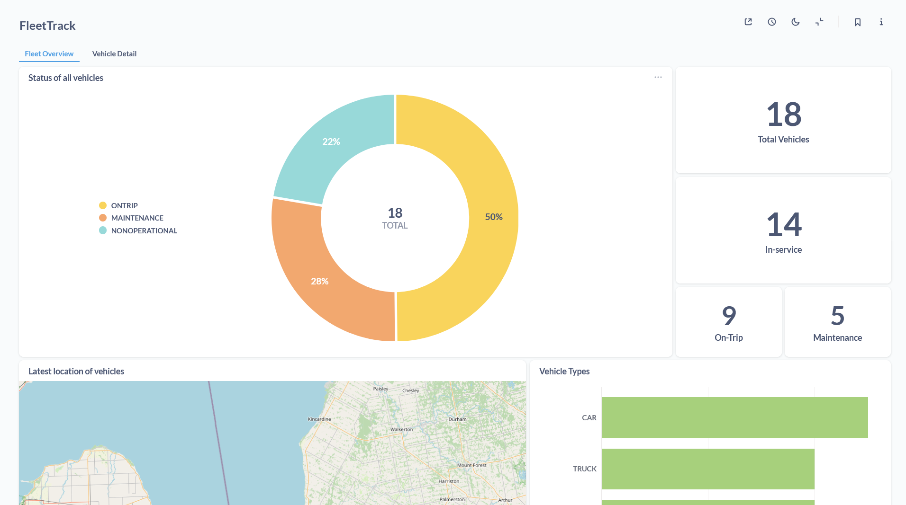
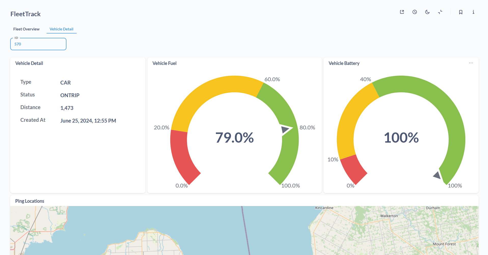
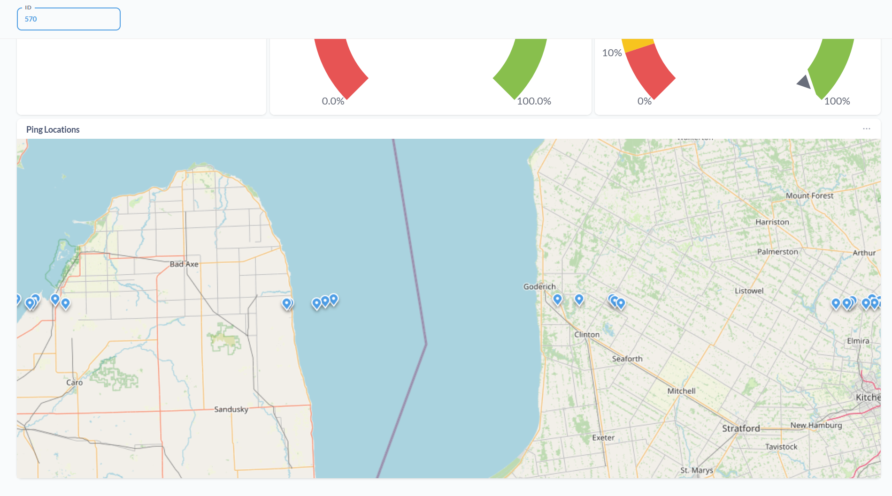

# FleetTrack

FleetTrack is an application focused on collection, storage and analytics of realtime data received from vehicles.

There are four main components of this project:
1. Producer - A web server built in FastAPI which receives data and pushes them into Kafka topics.
2. Consumer - An infinitely running Python script which listens to messages in the Kafka topic. Each message is cleaned, formatted and validated. After all checks are passed, data is inserted into PostgreSQL database.
3. Metabase - An open-source data visualization tool used to create dashboard on our data. Widget are created as Questions, Questions are put together in dashboard tabs. 
4. Simulation script - A Python script to simulate pings received from vehicles. Leverages Python multiprocessing

## Dashboard

### Tab 1

### Tab 2

## Architecture

## Tools used

- FastAPI (Python)
- PostgreSQL w/ Alembic
- Kafka
- Metabase

## Setup

- Start Kafka, Zookeeper, PostgreSQL and Metabase on Docker
  - `cd src`
  - `docker-compose up -d --build`
- Setup Python environment for the project and install dependencies from requirements.txt
- Create .env in root of project, use .env.example as a reference
- Initialize alembic to handle db migrations
  - `alembic init alembic`
  - `alembic revision -m "<message>"`
  - `alembic migrate head`

## Run the project

- Run scripts in the following order:
  - producer.py
  - consumer.py
  - run.py
- Open 